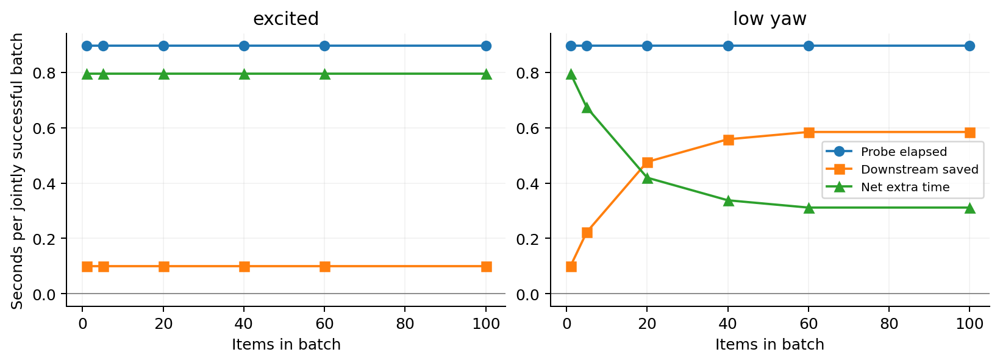
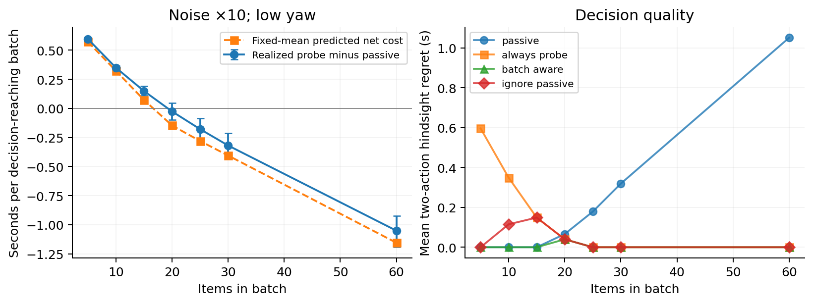

# SCARA Payload Learning

**Payload Probing with Passive Learning: Break-Even and Decision Regret in a SCARA Simulation**

A reproducible, synthetic four-DOF SCARA study of a practical question: **when does one extra payload-identification motion repay its cost, compared with learning during ordinary repeated handling?**

[Read the manuscript](paper/manuscript.pdf) · [Persian walkthrough](docs/START_HERE_FA.html) · [Response to review](RESPONSE_TO_REVIEW.md) · [Methods and provenance](docs/REVISION_METHODS.md)

## What the study found

- Under nominal settings, mean probe overhead remains positive through 100 items. At N=100 it is 0.796 s for exciting tasks and 0.311 s for low-yaw tasks, conditional on 27 paired completions.
- With tenfold sensor noise and a low-yaw 60-item batch, probing saves **1.052 s [0.923, 1.194]**, conditional on nine paired completions. The batch-aware rule selects all nine beneficial probes.
- The rule also misses beneficial individual nominal cases and makes errors near break-even. It is **not** claimed to be generally optimal or superior to published control algorithms.
- Faster probes cause additional failures; friction mismatch exposes misleading uncertainty estimates. These unfavorable results are retained.





## Reproduce the results

Python **3.12** is recommended. From the repository root, after creating your preferred virtual environment:

```sh
python -m pip install -r requirements.txt
python run.py demo --out demo_output
python revision.py analyze
python revision.py verify
python revision.py progress
```

`revision.py` automatically restores the losslessly compressed `revision/items.csv.gz` and verifies its SHA-256 before first use. You can also run `python restore_data.py` directly. Existing locally regenerated data are preserved.

`analyze` rebuilds the revised tables and figures from included raw data; `verify` checks frozen code hashes, design completeness, outcome consistency, paired-action identity and time/cost accounting.

To repeat all post-review simulations:

```sh
python revision.py rerun
```

Existing raw files are backed up to a timestamped `rerun_backups/` directory first. Planner wall-clock timings depend on the host. Linux execution was checked; Windows/macOS execution has not been validated. Detailed Windows and Linux commands are in the Persian walkthrough (download the HTML and open it locally).

## Experiment provenance

The extension contains **6,050 batch executions**, consisting of 5,800 separately frozen post-review runs and 250 explicitly sequential exploratory break-even runs. These are **not 6,050 independent scenarios**: seeds recur across methods, families and horizons. The original 1,080 held-out, 120 development and 120 different-seed stress runs remain unchanged in `results/`.

Local protocol hashes document provenance; they are not external preregistration. Original constant-selection history is only partly recoverable. See the response to review for all remaining limitations.

## Repository map

| Location | Contents |
|---|---|
| `paper/` | Current eight-page manuscript, editable LaTeX and references |
| `src/model.py`, `src/experiment.py` | Preserved original simulator and experiment |
| `src/model_r1.py`, `src/revision_experiment.py` | Parameterized extension and instrumentation |
| `src/revision_break_even.py` | Sequential refinement with separate frozen protocol |
| `src/revision_analysis.py`, `src/revision_tables.py` | Analysis and manuscript figures/tables |
| `revision/runs.csv`, `revision/items.csv` | Main post-review batch data and per-item traces |
| `revision/break_even_runs.csv` | Sequential refinement results |
| `revision/analysis.json` | Complete descriptive results |
| `revision/*protocol*.json` | Declared designs and frozen source hashes |
| `results/` | Preserved historical data |
| `docs/MODEL.md` | Dynamics and assumptions |

## Build the manuscript

A LaTeX installation with `latexmk` is required:

```sh
cd paper
latexmk -pdf -interaction=nonstopmode -halt-on-error manuscript.tex
```

The generated tables and figure PDFs are already included, as is the compiled manuscript.

## Scope and publication status

This is a **simulation and research-accounting benchmark**, with no hardware validation or safety guarantee. It is a separate research extension of the undergraduate SCARA project. No conference submission, acceptance, or universal advantage of active probing is claimed. The paper retains anonymous authors pending author-list and venue decisions.

A public software license has not yet been selected. Making the repository visible does not imply an open-source license or unrestricted reuse. Formal paper authorship and disclosures remain to be finalized.
